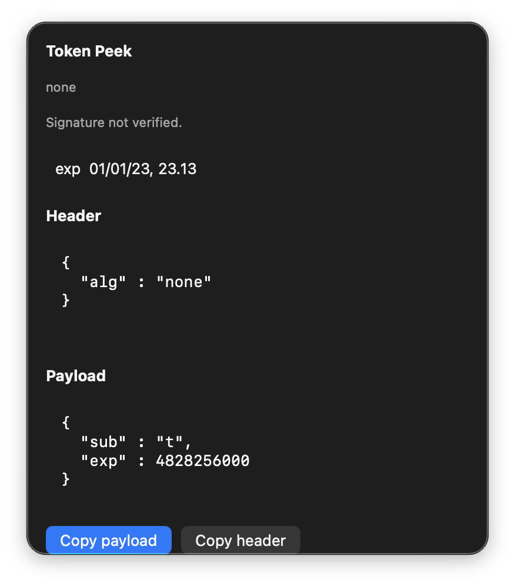

# Token Peek

[](https://github.com/BadryansahBangsawan/token-peek/actions/workflows/ci.yml)

Decode a JWT from the clipboard. The token is never written to disk, UserDefaults, logs, or Application Support.

Menu extra for macOS 14+. It lives on the **right** of the menu bar and does not show a Dock icon.



| | |
|---|---|
| Product | `TokenPeek` |
| Bundle ID | `engineer.badry.tokenpeek` |
| Status item | SF Symbol `key` (title: remaining time, `expired`, `invalid`, `JWT`, or `Token Peek`) |
| Panel | opaque ~360×420 pt |

## Features

- Watches the clipboard every 0.5s. A leading `Bearer ` is stripped.
- Pretty-prints header and payload JSON. The signature is **not** verified.
- Shows `exp` / `nbf` / `iat` in the current timezone. Remaining time refreshes every second while a token is shown.
- **Copy payload** and **Copy header**.

This is an inspector, not a verifier. Treat `alg: none` and any other algorithm the same: **Signature not verified.**

## Requirements

- macOS 14 Sonoma or later
- Swift 5.9 or later (Xcode or Command Line Tools) only if you build from source

## Install

```bash
git clone https://github.com/BadryansahBangsawan/token-peek.git
cd token-peek
bash package-app.sh
ditto dist/TokenPeek.app /Applications/TokenPeek.app
xattr -cr /Applications/TokenPeek.app
open /Applications/TokenPeek.app
```

Ad-hoc signed (`codesign -s -`). If Gatekeeper blocks it or says it is damaged, run the `xattr` line. If it is still blocked: System Settings → Privacy & Security → Open Anyway.

Do not run `dist/TokenPeek.app` while `/Applications/TokenPeek.app` is running (same bundle ID).

Enable **Open at Login** from Settings if you want it after reboot.

## How to open

This is an `LSUIElement` extra. Proof it is running is the **key** status item on the **right** of the menu bar, not a window from Finder or Launchpad.

1. Click that extra. The panel is opaque (~360×420), not a 10px strip.
2. If the bar is full, look behind the Control Center overflow chevron **«**.
3. Double-clicking the app in Finder/Launchpad only changes the left-side app name. That is expected. There is no Dock icon.

## Usage

1. Copy a JWT, or `Bearer <jwt>`.
2. Click the extra. Header and payload appear as read-only JSON.
3. **Copy payload** / **Copy header** write that JSON to the clipboard.
4. **Settings** at the bottom of the panel: Open at Login, Quit.

Empty clipboard or text that is not a three-part JWT: **Copy a JWT or Bearer token.** Menu title `Token Peek`.

### Menu title

| Condition | Title |
|---|---|
| No JWT | `Token Peek` |
| Decode failed | `invalid` |
| `exp` in the past | `expired` |
| No `exp` claim | `JWT` |
| Future `exp` | `exp 45s` / `exp 12m` / `exp 5h` / `exp 3d` |

`nbf` in the future adds a red **Not valid yet.**

## Permissions

Clipboard read. No Accessibility, Screen Recording, or network.

## Data

Nothing is persisted except Open at Login via `SMAppService`. The token is never saved.

## Privacy

No network. Clipboard text never leaves this Mac.

## Uninstall

Delete `/Applications/TokenPeek.app`. Turn off Open at Login in Settings first if you enabled it.

## Troubleshooting

| What you see | What to do |
|---|---|
| Finder “opens” nothing / no Dock icon | Click the **key** extra on the right of the menu bar. |
| Extra missing | Overflow **«**, or `pgrep -x TokenPeek` then `open /Applications/TokenPeek.app`. |
| “Damaged” / cannot verify | `xattr -cr /Applications/TokenPeek.app`. `spctl --assess` is `rejected` even when it runs. |
| **Copy a JWT or Bearer token.** | Copy a three-part JWT (`eyJ….….…`). |
| **Invalid JWT encoding.** | A segment is not Base64URL. |
| **Invalid JWT JSON.** | Header or payload is not a JSON object. |
| **Signature not verified.** | Expected. This app does not check signatures. |
| ~10px empty strip under the bar | Reinstall from this repo (panel min height 420). |

## Development

```bash
swift build
swift build -c release --product TokenPeek
bash package-app.sh
```

Layout: `Sources/` (SwiftPM executable), `Info.plist`, `Assets/AppIcon.icns`, `package-app.sh`. Never commit `dist/`. `FunTheme.swift` is copied verbatim (no shared package).

## License

[MIT](LICENSE)
